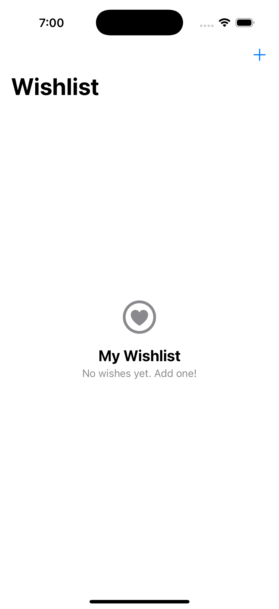
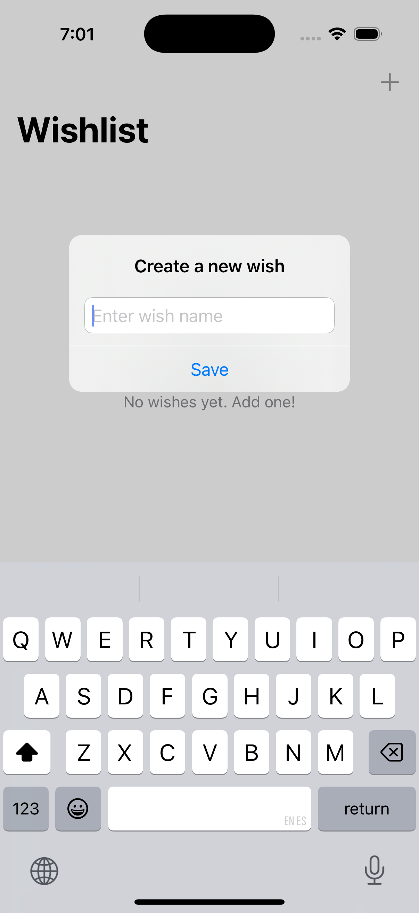
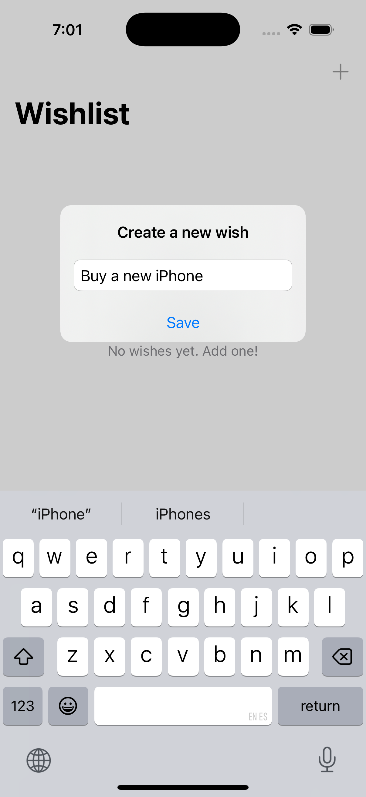
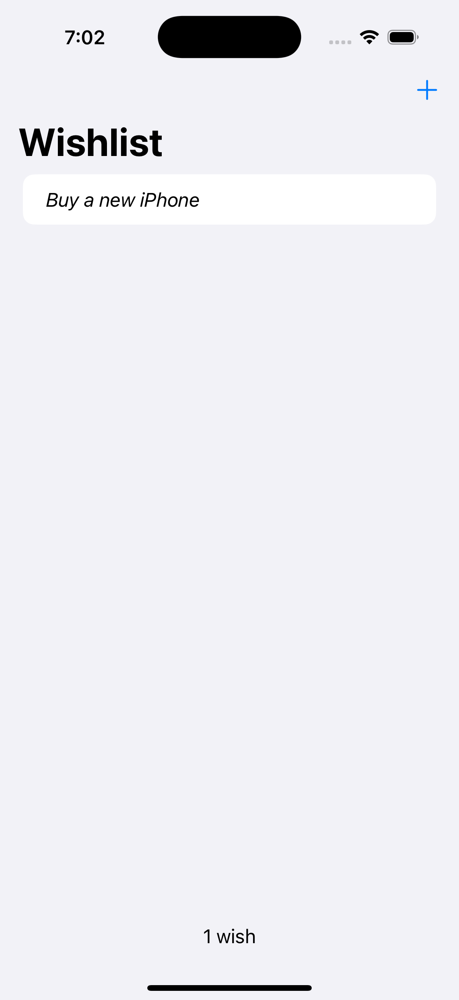
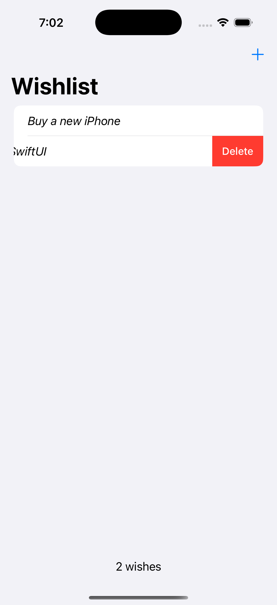

>[!Note]
>Tecnologías usadas: Swift, SwiftUI y SwiftData

El objetivo del proyecto es que el usuario pueda tener su lista de deseos o cosas por hacer, la app tiene un diseño simple para facilitar el uso al usuario

Aca podes ver las funciones de la app:

*Vista principal de la aplicación con lista vacía.*

*Vista de agregado de un nuevo wish.*

*Vista agregando nuevo wish.*

*Vista wish agregado.*

*Vista eliminando wish deslizando.*

